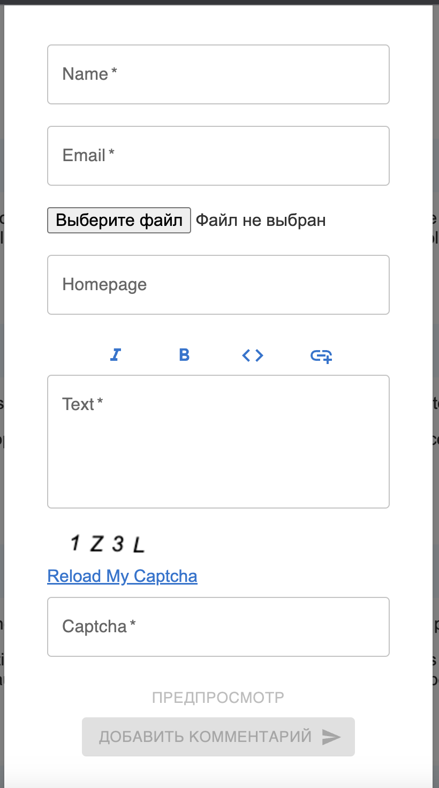

<h1 align="center">SpaProject:comments</h1>


<h2 align="center"><a  href="https://solitairevue.firebaseapp.com">Live Demo</a></h2>


## Description

**EXAMPLE**

<p align="center">
</p>

The commenting application was created from scratch on react.js. Users can add and also respond to comments of any nesting, comments are sent in real time, there is data validation in the form for adding a comment. Users can upload photo and text file. There is also comment sorting and pagination.


## About the project.

### Add comments

- The form in react was created using useForm and material. The form for adding a comment pops up using a custom modal window. It has required fields (name, email, text) and all fields have built-in data validation in useForm. The captcha was used by the simple-captcha component.
- Adding comments occurs in real time without reloading the page using webSocket, implemented using the socket.io library.
<p align="center"></p>

### Sort comments

- Sorting directly occurs on the backend side, from the frontend we send sorting parameters using JS.

  <p align="center"></p>

### View photos and files added by the user

- Photo viewer was implemented using the fslightbox-react library.
- File browsing was implemented using a custom modal window.

<p align="center"></p>
<p align="center"></p>

### Pagination

- Pagination was implemented using the material/Pagination library.
<p align="center"></p>


## Project setup

```
npm install
npm start
```

## Future scope

- Add winning animation.
